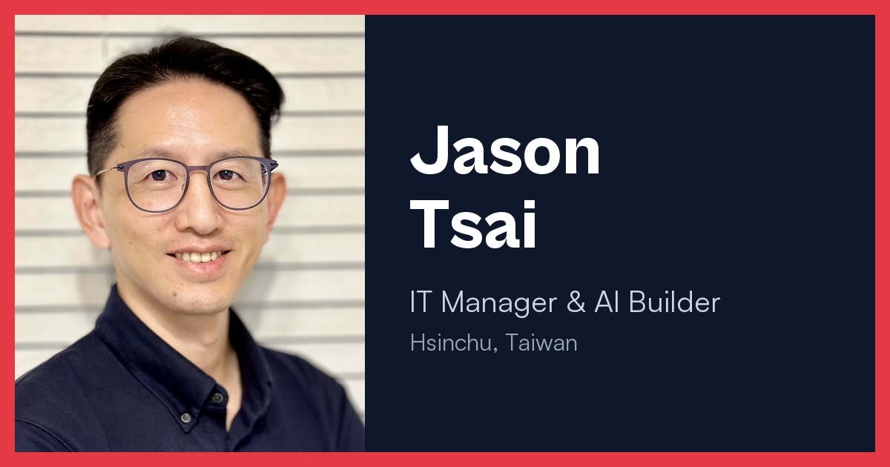

# Jason Tsai — Personal Site



**Live:** https://jasontsai.dev/

IT Manager with 20 years in semiconductor manufacturing, based in Hsinchu, Taiwan. By day I keep Tier-1 semiconductor operations online — C# / .NET, MS SQL, webMethods, SAP and MES integration. I lead a 10-person development team and am bringing AI into how we work — security and compliance first. On my own time I build with Claude Code, Claude, Gemini and ChatGPT: an always-on agent on a recycled MacBook, an automated semiconductor news brief, and an Obsidian knowledge system.

This repo is the source of my personal site: a single-page bento layout with an about card, a "now" card, a live Taipei clock, a 3D globe of countries I've visited, and a blog.

## Tech stack

- [Astro](https://astro.build) (static output)
- [UnoCSS](https://unocss.dev/), [motion](https://motion.dev/), [d3](https://d3js.org/) (globe)
- Hosted on [Cloudflare Pages](https://pages.cloudflare.com/) — every push to `master` deploys automatically

## Run locally

```bash
pnpm install
pnpm dev      # http://localhost:4321
pnpm build    # outputs to dist/
```

## Where to edit

| What | File |
| --- | --- |
| Name, intro, links | `src/components/IntroCard.astro`, `src/lib/constants.ts` |
| About / Now / Contacts | `src/components/AboutMe.astro`, `Now.astro`, `ContactsCard.astro` |
| Visited countries | `src/components/Globe.tsx` |
| Blog posts | `src/data/blog/*.md` |
| Site URL & sitemap | `astro.config.mjs` |

## Contact

- LinkedIn: https://www.linkedin.com/in/jason-tsai-7a926769/
- GitHub: https://github.com/JasonTsai1978

## Credits

Built on the open-source [astro-bento-portfolio](https://github.com/Ladvace/astro-bento-portfolio) template (MIT License). See [LICENSE](LICENSE).
